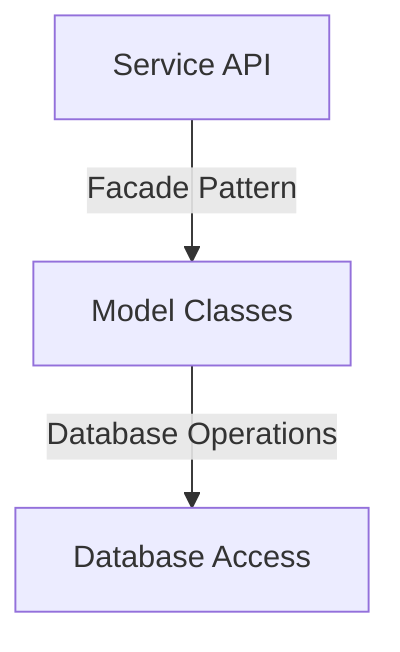
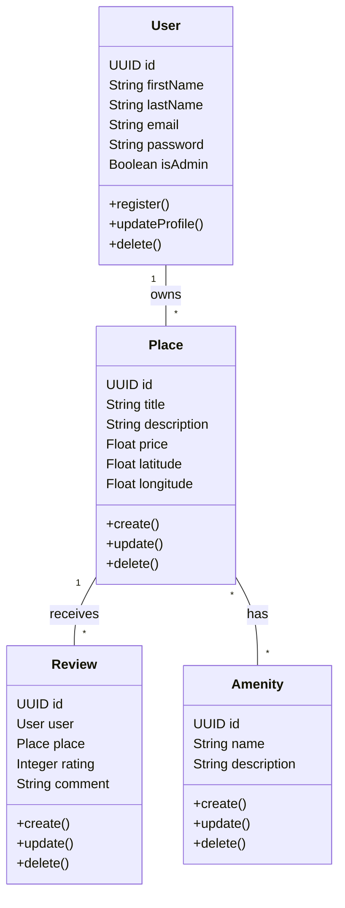
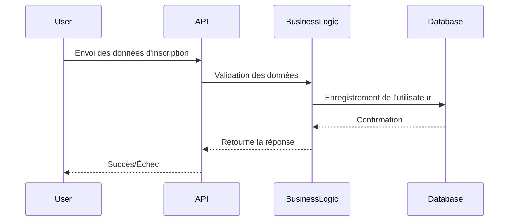

# HBNB Documentation

## Résumé des tâches à réaliser pour la documentation technique de HBnB Evolution

### Objectif général

Créer une documentation technique complète pour définir l'architecture et le design de l'application HBnB Evolution, une version simplifiée d’Airbnb. Cette documentation servira de référence pour les phases de développement.

---

## 1. Diagramme de haut niveau (Package Diagram)

📌 **Objectif** : Représenter l’architecture en trois couches de l’application et montrer la communication entre ces couches via le modèle de façade.

✅ **À faire** :

- Définir les trois couches principales :
    1. **Couche Présentation** (Services, API)
    2. **Couche Logique Métier** (Modèles : User, Place, Review, Amenity)
    3. **Couche Persistance** (Base de données)
- Illustrer les relations entre ces couches en UML (ex: avec Mermaid.js, draw.io).
- Ajouter une note explicative sur chaque couche et le rôle du modèle de façade.

---

## 2. Diagramme de classes détaillé (Class Diagram)

📌 **Objectif** : Modéliser les entités principales de la logique métier en UML.

✅ **À faire** :

- Définir les classes suivantes avec leurs attributs et méthodes :
    - **User** (nom, email, mot de passe, admin ou non…)
    - **Place** (titre, description, prix, latitude, longitude, liste d’amenities…)
    - **Review** (note, commentaire, utilisateur associé, place associée…)
    - **Amenity** (nom, description…)
- Ajouter les relations entre classes (associations, héritages, compositions).
- Inclure des identifiants uniques et des dates de création/mise à jour.
- Rédiger une note explicative sur chaque entité et ses interactions.

---

## 3. Diagrammes de séquence (Sequence Diagrams)

📌 **Objectif** : Montrer l’interaction entre les couches (API, logique métier, base de données) pour plusieurs actions.

✅ **À faire** :
Créer des diagrammes de séquence UML pour 4 API clés :

1. Inscription d’un utilisateur
2. Création d’un lieu (place)
3. Ajout d’un avis (review)
4. Affichage d’une liste de lieux

- Identifier les interactions entre le client, l’API, la logique métier, et la base de données.
- Détailler les requêtes et réponses à chaque étape.
- Ajouter une explication pour chaque diagramme.

---

## 4. Compilation de la documentation

📌 **Objectif** : Regrouper tous les diagrammes et explications dans un document structuré et professionnel.

✅ **À faire** :

- **Introduction** : Présentation du projet et objectif de la documentation.
- **Architecture générale** : Diagramme de haut niveau + explication.
- **Logique métier** : Diagramme de classes + explication des entités et relations.
- **Flux d’interaction API** : Diagrammes de séquence + explication du fonctionnement des API.
- **Relecture et mise en page** (PDF/Word).

---

📌 **Points clés à respecter** :

✔ Utiliser UML pour garantir clarté et standardisation.
✔ Assurer une cohérence dans les noms et relations entre entités.
✔ S’appuyer sur des outils comme Mermaid.js, draw.io pour les schémas.
✔ Vérifier la logique des interactions et la lisibilité du document.

🔎 **Finalité** : Obtenir une documentation technique complète et précise pour guider le développement de HBnB Evolution. 🚀

---

# Documentation Technique - HBnB Evolution

## Introduction

Ce document fournit une documentation technique détaillée pour le projet HBnB Evolution, une application simplifiée inspirée d'Airbnb. L'objectif est de définir l'architecture, la conception et les interactions du système afin de guider le développement de l'application.

---

## 1. Architecture Haut Niveau

L'application suit une architecture en trois couches avec l'utilisation du patron de conception **Facade** pour simplifier les interactions entre les couches.

### 1.1. Présentation des Couches

- **Couche de Présentation** : Fournit les services et API permettant aux utilisateurs d'interagir avec le système.
- **Couche Métier** : Contient la logique métier et les modèles des entités principales.
- **Couche de Persistance** : Responsable du stockage et de la récupération des données.

### 1.2. Diagramme de Packages (Mermaid.js)

---

## 2. Diagramme de Classes - Couche Métier

Le diagramme de classes détaille les entités et leurs relations dans la couche métier.

### 2.1. Entités Principales

- **User** : Représente un utilisateur avec des attributs comme prénom, nom, email et mot de passe. Il peut être administrateur.
- **Place** : Représente un lieu avec des informations comme titre, description, prix, latitude et longitude.
- **Review** : Contient les évaluations des utilisateurs avec une note et un commentaire.
- **Amenity** : Représente une commodité pouvant être associée à un lieu.

### 2.2. Diagramme UML (Mermaid.js)

---

## 3. Diagrammes de Séquence - Appels API

### 3.1. Inscription d'un Utilisateur

---

## 4. Conclusion

Cette documentation fournit une vue complète de l’architecture et de la conception de l’application HBnB Evolution. Elle servira de référence pour la phase d’implémentation et garantira une bonne compréhension du système.

