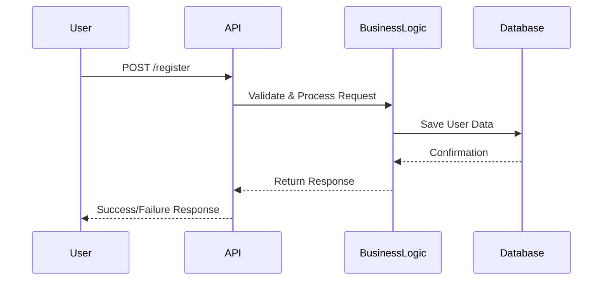
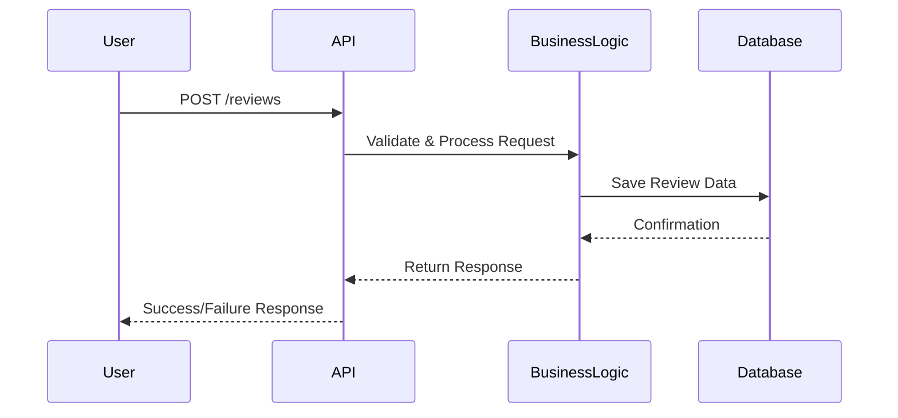
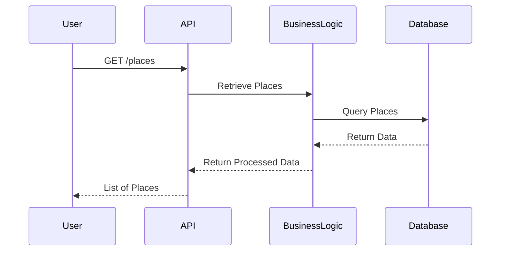
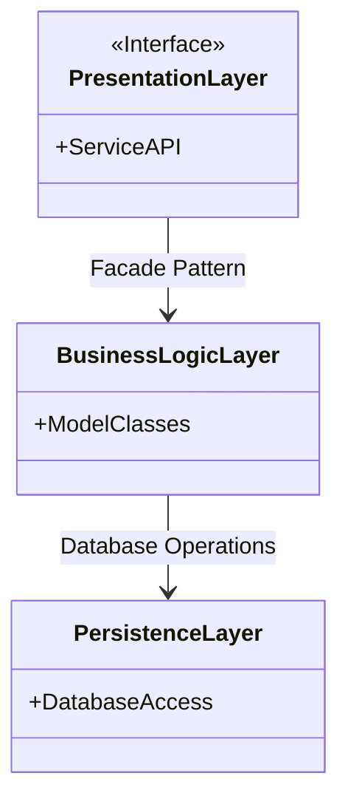
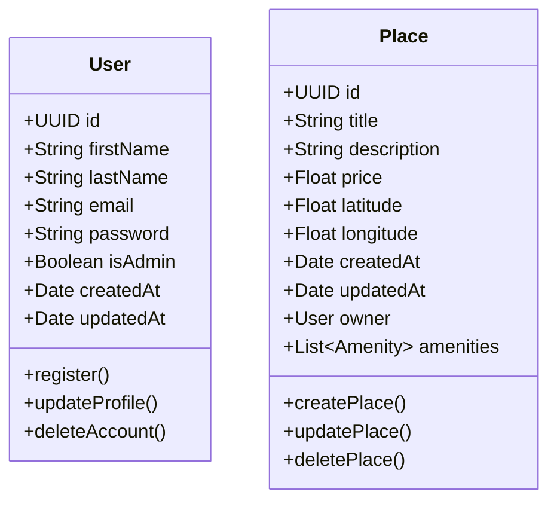

# HBNB Documentation in English

## Summary of Tasks for the HBnB Evolution Technical Documentation

### General Objective

Create a comprehensive technical documentation to define the architecture and design of the HBnB Evolution application, a simplified version of Airbnb. This documentation will serve as a reference for development phases.

---

## 1. High-Level Diagram (Package Diagram)

📌 **Objective**: Represent the three-layer architecture of the application and show the communication between these layers via the facade model.

✅ **To Do**:

- Define the three main layers:
  - **Presentation Layer** (Services, API)
  - **Business Logic Layer** (Models: User, Place, Review, Amenity)
  - **Persistence Layer** (Database)
- Illustrate the relationships between these layers in UML (e.g., with Mermaid.js, draw.io).
- Add explanatory notes on each layer and the role of the facade model.

---

## 2. Detailed Class Diagram (Class Diagram)

📌 **Objective**: Model the main business logic entities in UML.

✅ **To Do**:

- Define the following classes with their attributes and methods:
  - **User** (name, email, password, admin or not…)
  - **Place** (title, description, price, latitude, longitude, list of amenities…)
  - **Review** (rating, comment, associated user, associated place…)
  - **Amenity** (name, description…)
- Add relationships between classes (associations, inheritance, compositions).
- Include unique identifiers and creation/update timestamps.
- Write an explanatory note on each entity and its interactions.

---

## 3. Sequence Diagrams

📌 **Objective**: Show the interaction between layers (API, business logic, database) for several actions.

✅ **To Do**:
Create UML sequence diagrams for 4 key APIs:

1. User registration
2. Creation of a place
3. Adding a review
4. Displaying a list of places

- Identify interactions between the client, API, business logic, and database.
- Detail requests and responses at each step.
- Add an explanation for each diagram.

### 3.1. User Registration

### 3.2. Creation of a Place

### 3.3. Adding a Review

### 3.4. Displaying a List of Places

---

## 4. Documentation Compilation

📌 **Objective**: Gather all diagrams and explanations into a structured and professional document.

✅ **To Do**:

- **Introduction**: Project presentation and documentation objectives.
- **General Architecture**: High-level diagram + explanation.
- **Business Logic**: Class diagram + explanation of entities and relationships.
- **API Interaction Flow**: Sequence diagrams + explanation of API functionality.
- **Review and Formatting** (PDF/Word).

📌 **Key Points to Follow**:

✔ Use UML to ensure clarity and standardization.
✔ Maintain consistency in names and relationships between entities.
✔ Use tools like Mermaid.js, draw.io for diagrams.
✔ Verify the logic of interactions and document readability.

🔎 **Final Goal**: Obtain a complete and precise technical documentation to guide the development of HBnB Evolution. 🚀

---

# Technical Documentation - HBnB Evolution

## Introduction

This document provides a detailed technical documentation for the HBnB Evolution project, a simplified application inspired by Airbnb. The goal is to define the system's architecture, design, and interactions to guide application development.

---

## 1. High-Level Architecture

The application follows a three-layer architecture with the **Facade** design pattern to simplify interactions between layers.

### 1.1. Layer Overview

- **Presentation Layer**: Provides services and APIs allowing users to interact with the system.
- **Business Layer**: Contains business logic and the main entity models.
- **Persistence Layer**: Responsible for data storage and retrieval.

### 1.2. Package Diagram (Mermaid.js)

---

## 2. Class Diagram - Business Layer

The class diagram details the entities and their relationships in the business layer.

### 2.1. Main Entities

- **User**: Represents a user with attributes like first name, last name, email, and password. Can be an administrator.
- **Place**: Represents a location with information such as title, description, price, latitude, and longitude.
- **Review**: Contains user evaluations with a rating and comment.
- **Amenity**: Represents an amenity that can be associated with a place.

### 2.2. UML Diagram (Mermaid.js)

---

## 4. Conclusion

This documentation provides a comprehensive overview of the architecture and design of the HBnB Evolution application. It will serve as a reference for the implementation phase and ensure a good understanding of the system.

