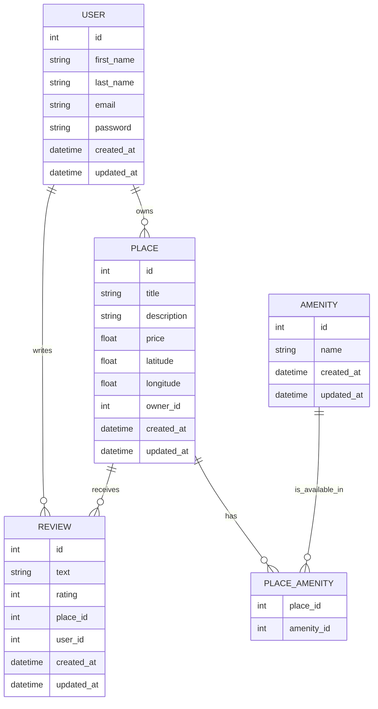

# HBNB API Project

Une API RESTful moderne pour la gestion de locations de propriétés, inspirée par Airbnb.

## Description

HBNB API est une interface de programmation complète permettant de gérer des locations de propriétés, des utilisateurs, des avis et des commodités. Elle est construite avec Flask et utilise une architecture moderne basée sur SQLAlchemy pour la persistance des données.

### Fonctionnalités Principales

- 🏠 Gestion complète des propriétés (création, modification, suppression, recherche)
- 👥 Système d'authentification et gestion des utilisateurs
- ⭐ Système d'avis et de notations
- 🛋️ Gestion des commodités pour les propriétés
- 🔐 Sécurité JWT pour l'authentification
- 📚 Documentation Swagger intégrée

## Prérequis

- Python 3.8+
- PostgreSQL
- pip

## Installation

1. Installer python3-venv si ce n'est pas déjà fait :
```bash
sudo apt-get install python3-venv
```

2. Cloner le repository :
```bash
git clone [url-du-repo]
cd hbnb-api
```

3. Créer l'environnement virtuel :
```bash
python3 -m venv venv
```

4. Activer l'environnement virtuel :
```bash
source venv/bin/activate
```

5. Installer les dépendances :
```bash
pip install -r requirements.txt
```

6. Configurer les variables d'environnement :
```bash
cp .env.example .env
# Éditer .env avec vos configurations
```

7. Initialiser la base de données :
```bash
python setup_db.py
```

## Utilisation

1. Lancer l'application :
```bash
python run.py
```

2. Accéder à l'interface Swagger :
```
http://localhost:5000/api/v1/
```

## Tests

Pour exécuter les tests unitaires :
```bash
# Exécuter tous les tests
python -m unittest discover tests

# Exécuter un test spécifique
python -m unittest tests/test_amenity_api.py
```

## Structure de la Base de Données

Le projet utilise une base de données relationnelle avec le schéma suivant :



## Architecture

Le projet suit une architecture en couches :
- API (app/api/) : Endpoints REST
- Services (app/services/) : Logique métier
- Models (app/models/) : Entités de données
- Persistence (app/persistence/) : Couche d'accès aux données

## Documentation

Pour plus de détails sur l'utilisation de l'API, consultez le fichier GUIDE.md ou accédez à la documentation Swagger à l'adresse : `http://localhost:5000/api/v1/`.

## Désactivation de l'environnement virtuel

```bash
deactivate
```
