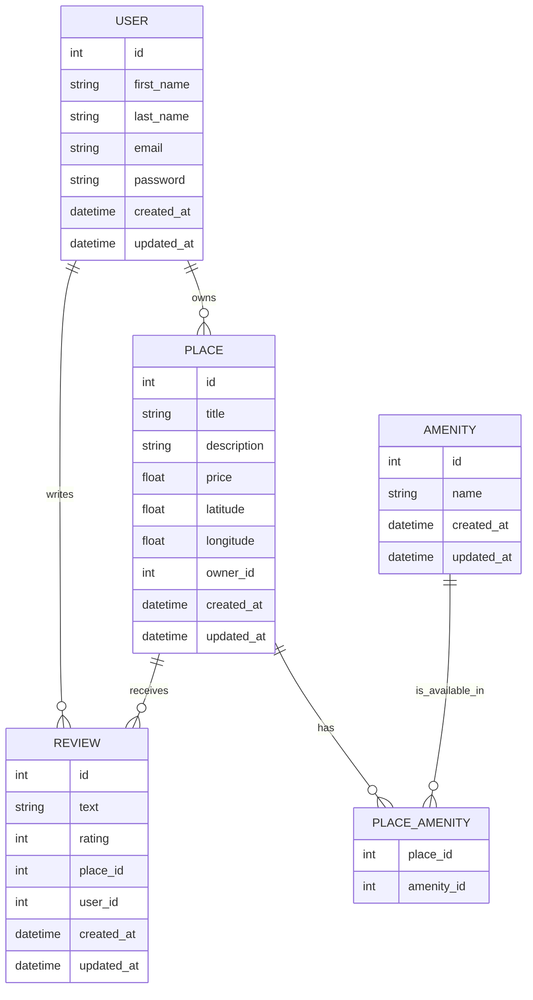

# 🏡 HBNB API Project

Une API RESTful moderne pour la gestion de locations de propriétés, inspirée d'Airbnb.

---

## 📖 Présentation

**HBNB API** est une solution complète de backend construite avec **Flask**, intégrant :
- La gestion des utilisateurs et des propriétés
- Un système d'avis et de commodités
- L'authentification sécurisée par **JWT**
- Une base de données relationnelle via **SQLAlchemy**
- Une documentation interactive **Swagger / OpenAPI 3.0**

---

## 🚀 Fonctionnalités Clés

- 🏠 **CRUD des propriétés** : création, recherche, mise à jour, suppression
- 👤 **Gestion des utilisateurs** : inscription, login, rôles
- 💬 **Avis & Notations** : feedback utilisateurs
- 🏩️ **Commodités** : options supplémentaires pour les propriétés
- 🔐 **Sécurité JWT** : authentification & autorisation
- 📊 **Swagger UI** : interface de test de l'API
- 🧪 **Tests intégrés** : fichiers `test.py`, `test_mdp_admin.py`

---

## 🧱 Architecture du Projet

```
part3/
│
├── app/
│   ├── __init__.py         # Initialisation de l'application Flask
│   ├── extensions.py       # Extensions (JWT, DB, Swagger, etc.)
│   └── hbnb.db             # Base de données SQLite
│
├── config.py               # Configuration Flask (environnement, JWT, DB)
├── run.py                  # Point d'entrée de l'application
├── setup.py                # Script d'installation
├── setup_db.py             # Script de création/init de la DB
├── requirements.txt        # Dépendances Python
├── .env                    # Variables d'environnement (non versionné)
├── .env.example            # Exemple de configuration
├── README.md               # Ce fichier
└── GUIDE.md                # Instructions détaillées (à lire aussi)
```

---

## 📦 Prérequis

- Python **3.8+**
- PostgreSQL (si utilisé à la place de SQLite)
- `pip` ou `poetry` (pour la gestion des dépendances)

---

## ⚙️ Installation

```bash
# 1. Cloner le repo
git clone https://github.com/batrivieredev/holbertonschool-hbnb/
cd hbnb-api

# 2. Créer un environnement virtuel
python3 -m venv venv
source venv/bin/activate

# 3. Installer les dépendances
pip install -r requirements.txt

# 4. Configurer l'environnement
cp .env.example .env
# ➔ Modifier les variables dans .env si nécessaire

# 5. Initialiser la base de données
python setup_db.py

# 6. Lancer le serveur
python run.py
```

---
## Tests

Pour exécuter les tests unitaires :
```bash
# Exécuter tous les tests
python -m unittest discover tests

# Exécuter un test spécifique
python -m unittest tests/test_amenity_api.py

---

## 🔑 Authentification JWT

L'authentification se fait via des **JSON Web Tokens**.

- Endpoints typiques :
  - `POST /auth/login` : authentification
  - `POST /auth/register` : inscription
- Le token JWT est retourné à la connexion, puis utilisé dans les headers :
  ```
  Authorization: Bearer <votre_token>
  ```

---

## 🥪 Exécuter les tests

```bash
# Lancer les tests unitaires
python test.py
```
---
## Structure de la Base de Données

Le projet utilise une base de données relationnelle avec le schéma suivant :



## Architecture

Le projet suit une architecture en couches :
- API (app/api/) : Endpoints REST
- Services (app/services/) : Logique métier
- Models (app/models/) : Entités de données
- Persistence (app/persistence/) : Couche d'accès aux données

---

## 💾 Exemples d'utilisation via cURL

```bash
# Obtenir un token
curl -X POST http://127.0.0.1:5000/auth/login \
  -H "Content-Type: application/json" \
  -d '{"email": "admin@hbnb.com", "password": "adminpass"}'

# Créer une propriété
curl -X POST http://127.0.0.1:5000/properties \
  -H "Authorization: Bearer <votre_token>" \
  -H "Content-Type: application/json" \
  -d '{"name": "Appartement T3", "description": "Centre-ville", "price": 120}'
```

---

## 📝 Documentation Swagger

Swagger UI est disponible à l'adresse suivante une fois l'app lancée :

📍 `http://localhost:5000/api/docs`

---

## 👨‍💼 Auteurs & Contributeurs

- Baptiste RIVIERE — _Développeur principal_
- Ibrahim HOUMAIDI — _Développeur principal_
- Ludwig VANDERBERGUE — _Développeur principal_
- Holberton School Rennes — _Projet pédagogique_

---


## 📌 Remarques

- La base SQLite par défaut (`app/hbnb.db`) peut être remplacée par une base PostgreSQL/MySQL.
- Le fichier `.env.example` contient tous les paramètres nécessaires pour un déploiement local ou cloud.
